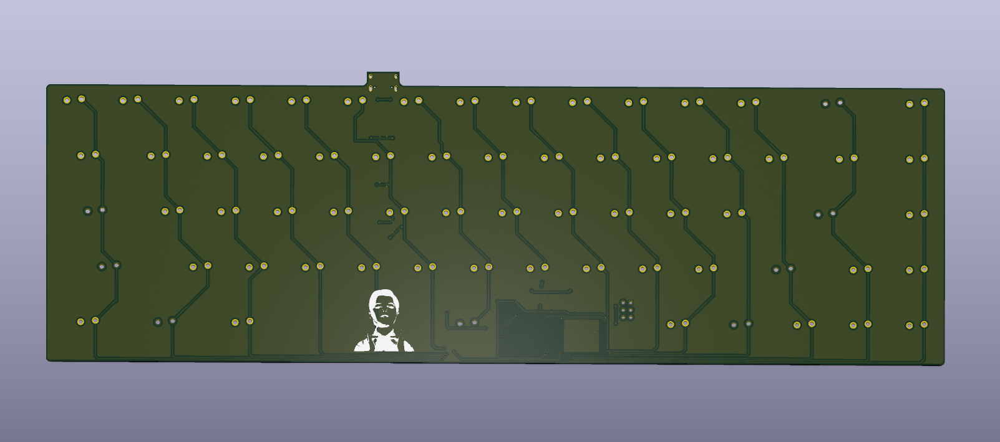

# Custom 60% Keyboard From Scratch

A custom mechanical keyboard designed from scratch in KiCad — schematic, PCB, and supporting files.

The goal of this repo is to document and archive my completed work on this project.


## Current Status

> **Manufacturing & Physical Assembly** — The PCB design is complete and the board has been sent to manufacturing.

Future Plans:
- soldering components & microcontroller from digikey(already bought and delivered)
- 3D Print keyboard case
- install switches & keycaps (already bought and on hand)
- install firmware (QMK)

## Renders & PCB Design

The case for the keyboard has been designed and needs to be 3D printed.

**SolidWorks renders of completed case & PCB:**


**KiCad renders:**




**KiCad PCB editor view & schematic:**


## About the Build

The goal of this build was to expand my electronics knowledge while physically creating a project I'd be proud of. This keyboard was designed following the excellent guide by Masterzen, [**Designing a keyboard from scratch**](https://www.masterzen.fr/2020/05/03/designing-a-keyboard-part-1/).


## Repository Structure

```
Keyboard/      KiCad project — open Keyboard/Keyboard.kicad_pro
libraries/     All footprint & symbol libraries (bundled, project-relative paths)
production/    Gerbers, drill files, and BOM as sent to manufacturing
cad/           STEP export and SolidWorks files for the case
images/        Renders and screenshots
```

## Opening the Project

```
git clone https://github.com/archerlepke/Kicad-Keyboard.git
```

Open `Keyboard/Keyboard.kicad_pro` in KiCad (v7 or newer). All custom libraries are
included in the repo and referenced with project-relative paths, so no library
setup is required.

## Library Credits

- [MX_Alps_Hybrid](https://github.com/ai03-2725/MX_Alps_Hybrid) — switch footprints & symbols by ai03
- [Type-C](https://github.com/ai03-2725/Type-C.pretty) — USB-C footprints & symbols by ai03
- [random-keyboard-parts](https://github.com/ai03-2725/random-keyboard-parts.pretty) — misc keyboard parts by ai03

## Tools Used

- **KiCad** — schematic capture and PCB design
- **SolidWorks** — 3D modeling
- **SolidWorks Visualize** — renders
- **QMK** — keyboard firmware (planned)

---

*This is an ongoing project*
