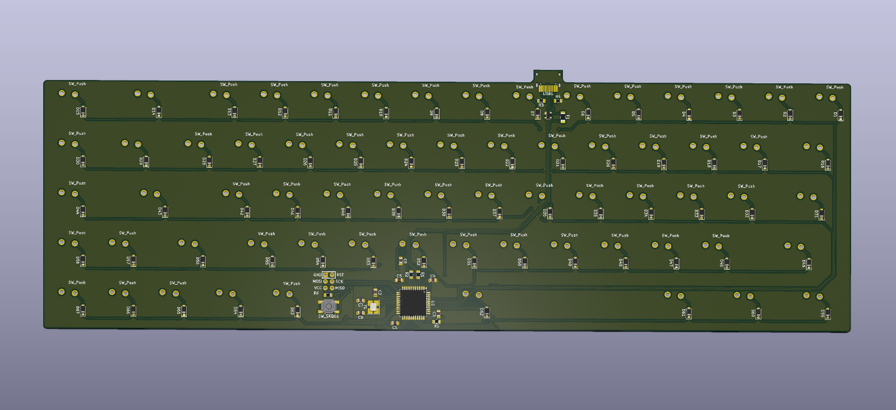

# Custom Mechanical Keyboard From Scratch

A custom mechanical keyboard designed from scratch in KiCad — schematic, PCB, and supporting files.

The goal of this repo is to document and archive my completed work on this project.

## Current Status

> **Manufacturing & Physical Assembly** — The PCB design is complete and the board has been sent to manufacturing.

Future Plans:
- 3D Print keyboard case
- install switches & keycaps (already bought and on hand)
- install firmware (QMK)

## Renders & PCB Design

The case for the keyboard has been designed and needs to be 3D printed.

**SolidWorks renders of completed case & PCB:**

**KiCad renders:**

**KiCad PCB editor view & schematic:**

## About the Build

The goal of this build was to expand my electronics knowledge while physically creating a project I'd be proud of. This keyboard was designed following the excellent guide by Masterzen, [**Designing a keyboard from scratch**](https://www.masterzen.fr/2020/05/03/designing-a-keyboard-part-1/).

## Repository Contents:

- KiCad schematic (`.kicad_sch`) and PCB layout (`.kicad_pcb`) files
- Footprint & symbol libraries
- Gerber files
- `images/` — renders and PCB design images

## Tools Used

- **KiCad** — schematic capture and PCB design
- **SolidWorks** — 3D modeling
- **SolidWorks Visualize** — renders
- **QMK** — keyboard firmware (planned)

---

*This is an ongoing project*
